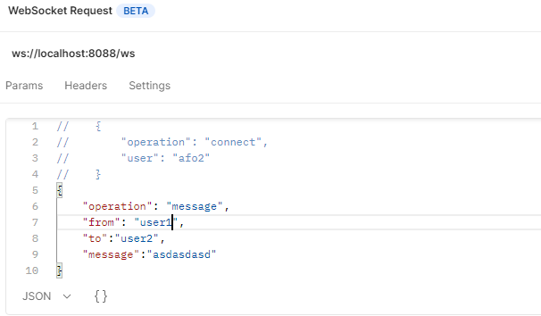

# Go Real Time Socket with Goroutine

Real Time Messaging (One to One) Goroutine and channel is used.

 

 

Check Simple Messaging with go without goroutine [go_socket_v0.1](https://github.com/FurkanOzkaya/go_socket_v0.1)

